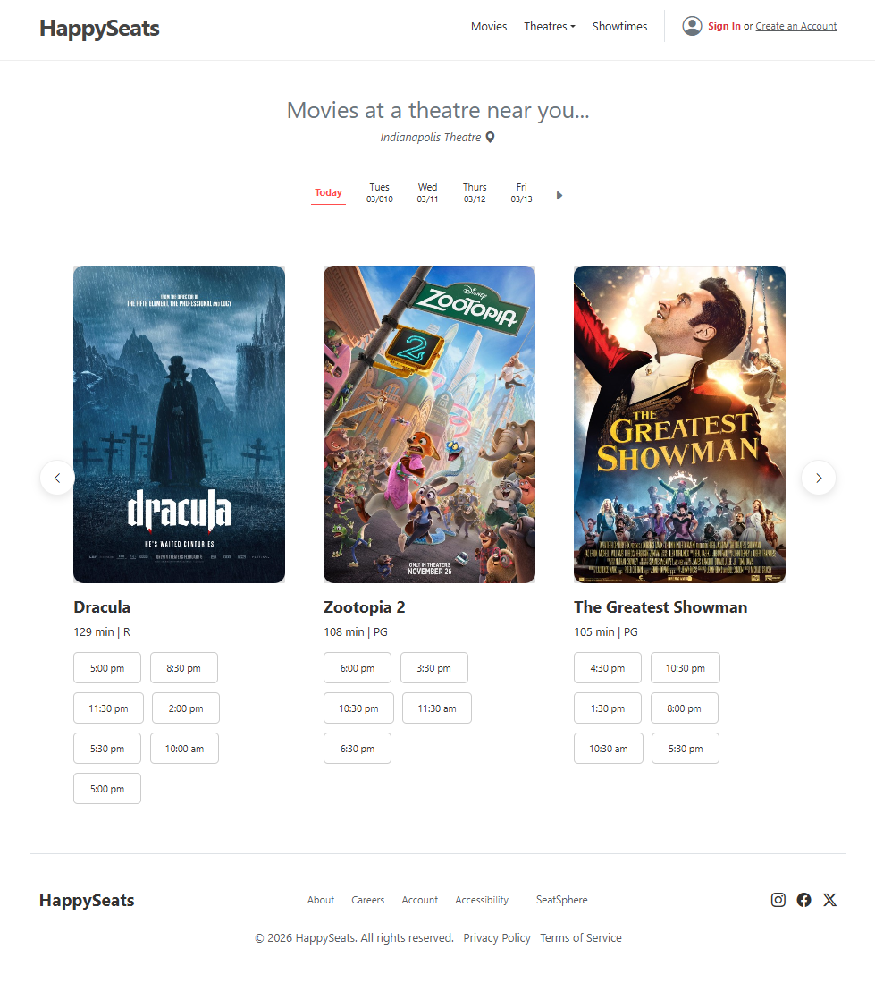
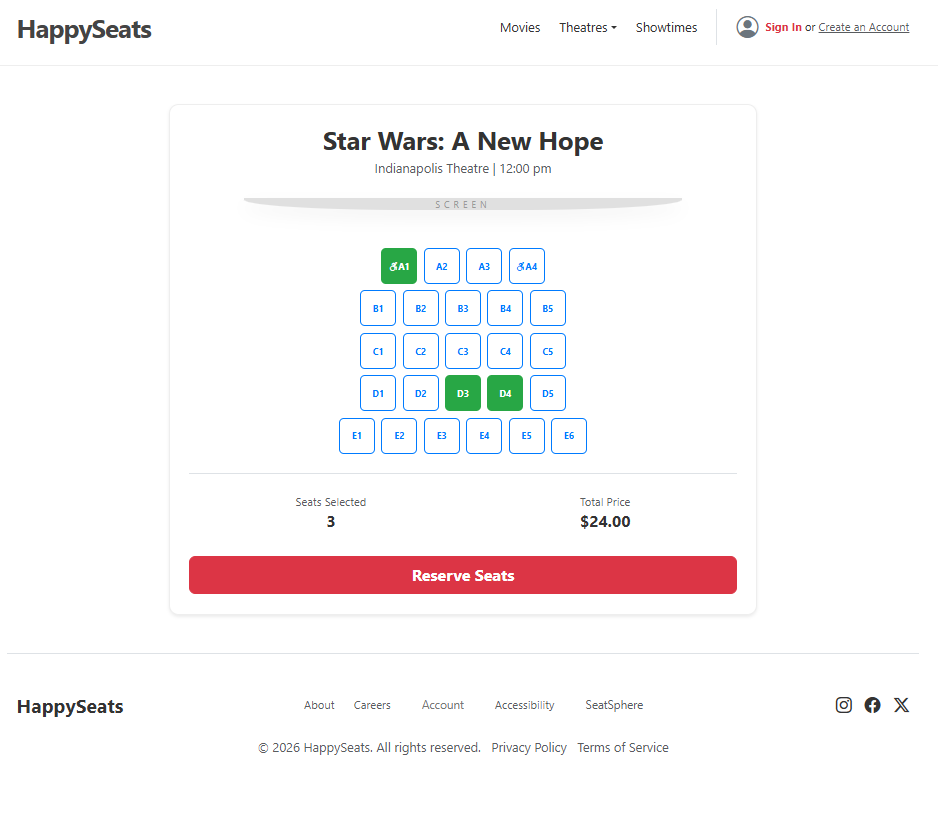
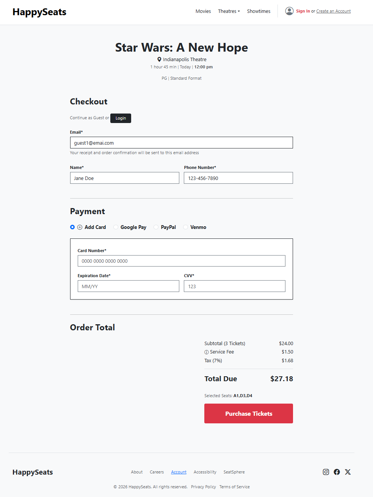
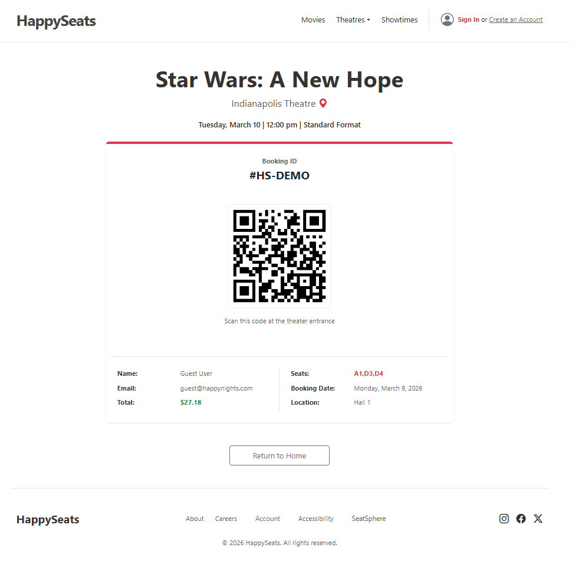
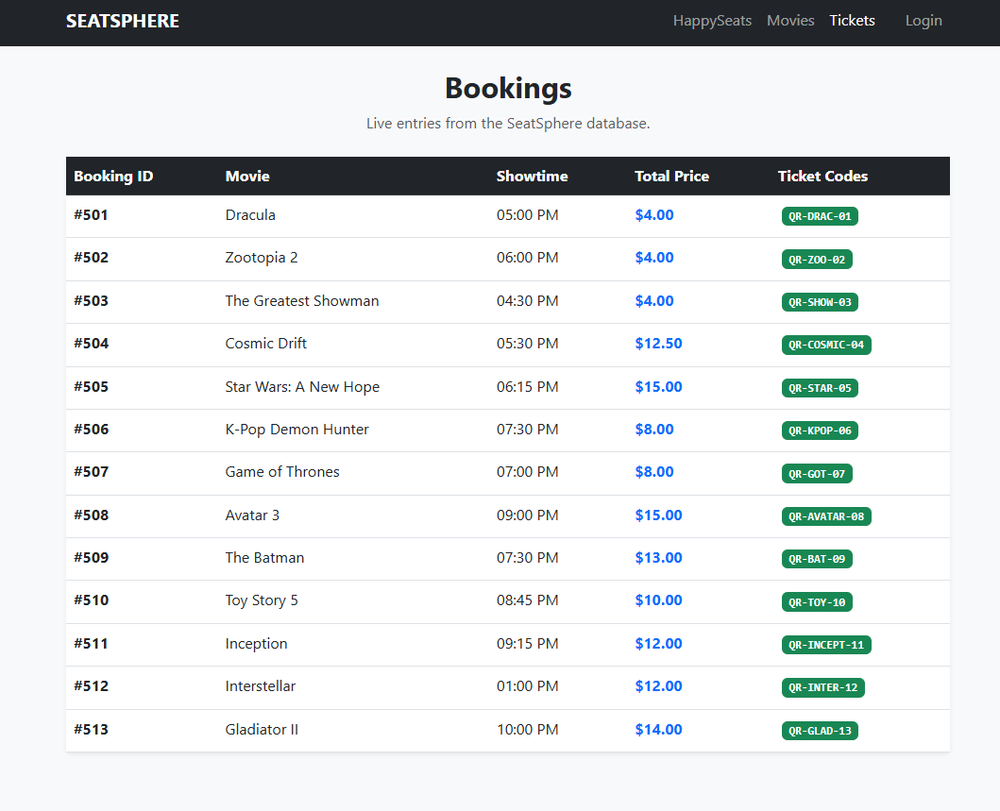

# 🎬 SeatSphere (HappySeats) - Movie Ticket Booking System
### Folder 3: `3_integration_testing/README.md`

# 🔗 Integration Testing
**Folder:** `3_integration_testing`

## 📝 Description
This section tests the end-to-end user flow and the communication between the **Node.js frontend (Port 3000)** and the **Java API (Port 8080)**.

## 🖼️ Integration Proof & UI Gallery

### 🖥️ System Connectivity
To verify the handshake between the Java API and the Node.js frontend, both servers were initialized and verified.

| Backend (Port 8080) | Frontend (Port 3000) |
| :--- | :--- |
|  |  |

---

### 🛣️ The User Journey Flow
1.  **`index.html`**: Fetches movie list (Dracula, Zootopia 2, etc.) and 62 showtimes from MySQL.
   
2.  **`seats.html`**: Retrieves specific layouts for Halls 1-6 and maps `is_handicap` seats.
   
3.  **`checkout.html`**: Collects guest info (Email, Card, Phone) and POSTs booking data.
   
4.  **`confirmation.html`**: Retrieves the generated Booking ID and QR code for the final receipt.
   
5. **`dashboard.html`**: Retrieves the generated Booking ID and QR code for the final receipt.
   

---

## 🛠️ Ongoing Development
* **Admin Dashboard Sync:** Currently working on fully syncing the Frontend Admin Dashboard with the Backend for live database management.
* **Data Refining:** Refining fetch calls for Customer Name and Hall name on the final confirmation page.

