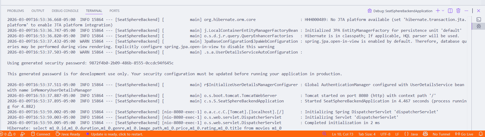
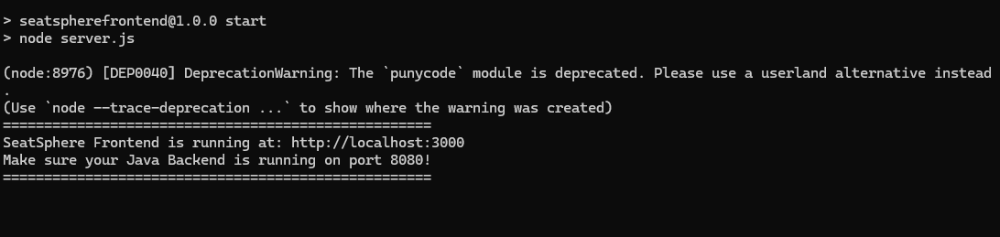
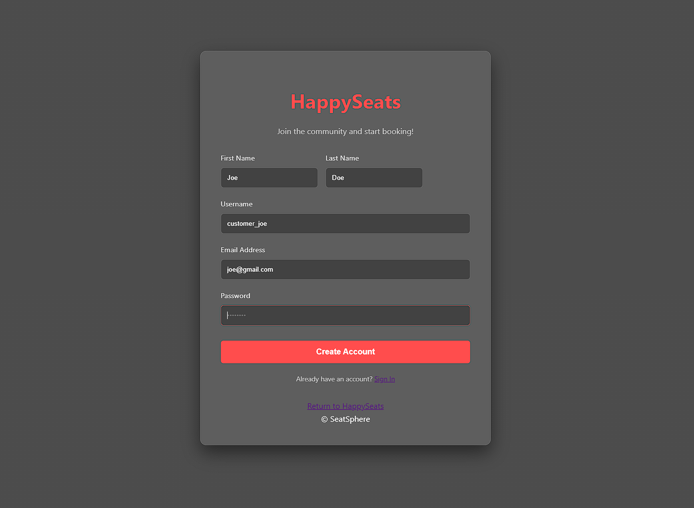
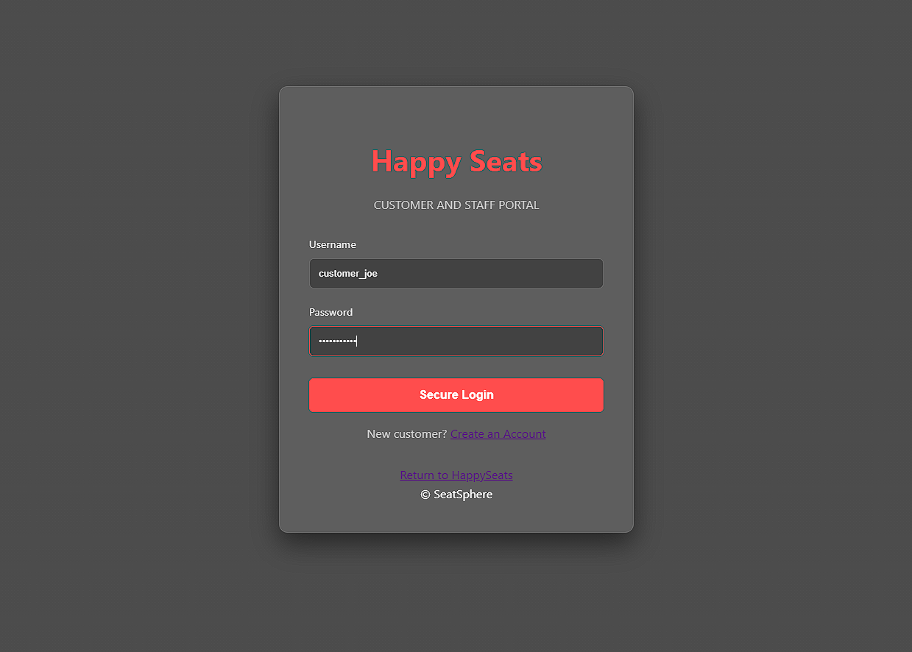
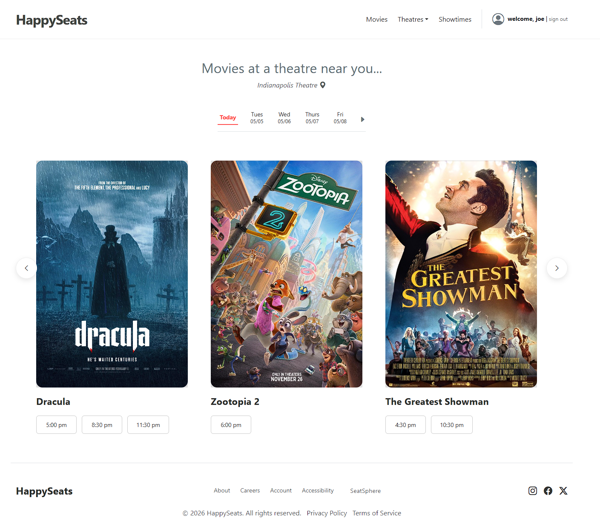
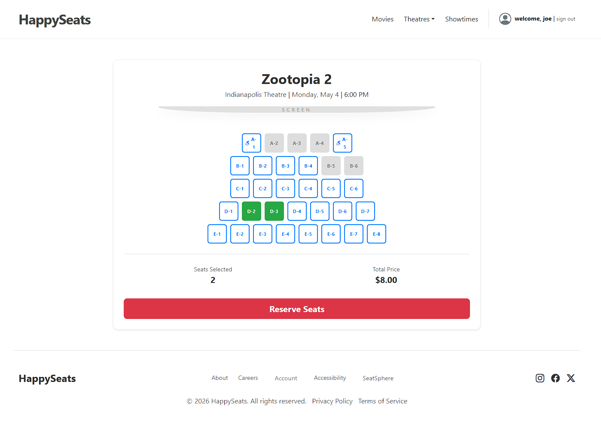
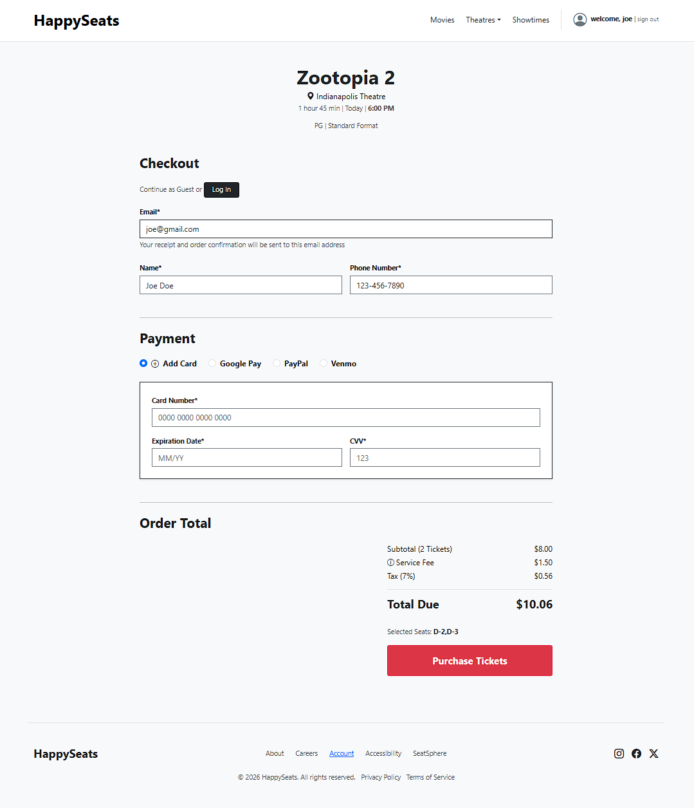
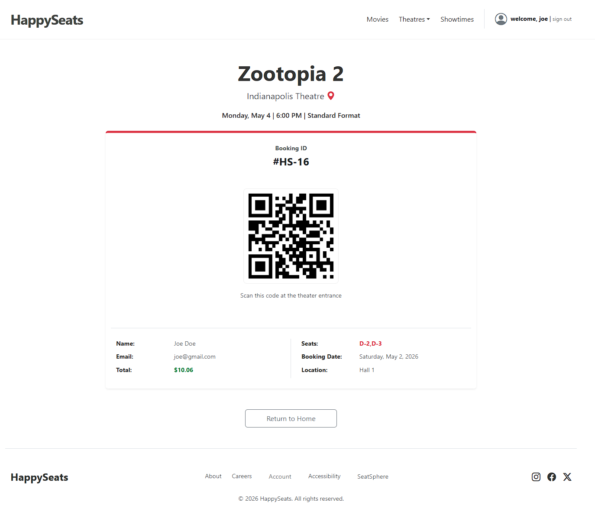
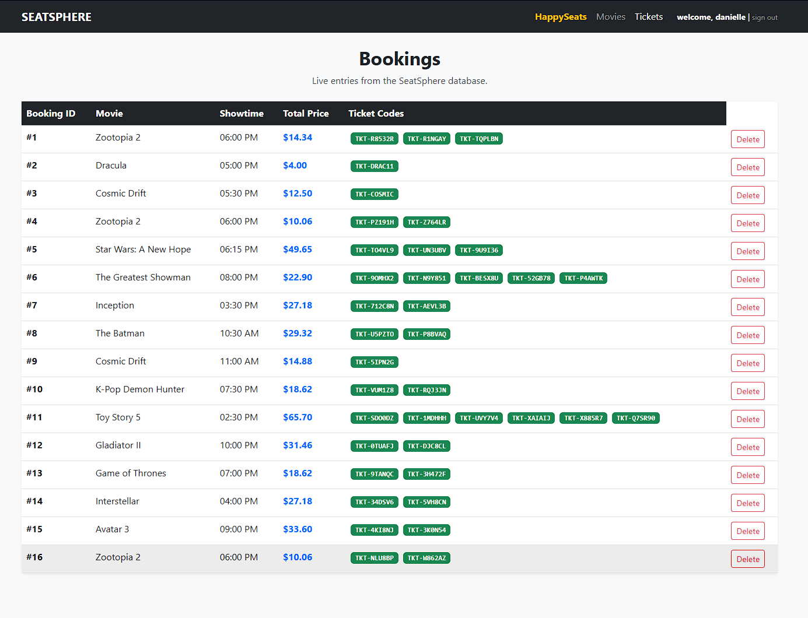

# 🎬 SeatSphere (HappySeats) - Movie Ticket Booking System
### Folder 3: `3_integration_testing/README.md`

# 🔗 Integration Testing
**Folder:** `3_integration_testing`

## 📝 Description
This section tests the end-to-end user flow and the communication between the **Node.js frontend (Port 3000)** and the **Java API (Port 8080)**.

## 🖼️ Integration Proof & UI Gallery

### 🖥️ System Connectivity
To verify the handshake between the Java API and the Node.js frontend, both servers were initialized and verified.

| Backend (Port 8080) | Frontend (Port 3000) |
| :--- | :--- |
|  |  |

---

### 🛣️ The User Journey Flow
1. **`register.html`**: New users register details, which are persisted to the `users` table with the default `CUSTOMER` role.
   
2.  **`login.html`**: Authenticates credentials against the database to establish a secure session.
   
3.  **`index.html`**: Fetches movie list (Dracula, Zootopia 2, etc.) and 60+ showtimes from MySQL.
   
4.  **`seats.html`**: Retrieves specific layouts for Halls 1-6 and maps `is_handicap` seats.
   
5.  **`checkout.html`**: Collects guest info (Email, Card, Phone) and POSTs booking data.
   
6.  **`confirmation.html`**: Retrieves the generated Booking ID and QR code for the final receipt.
   
7. **`dashboard.html`**: Retrieves the generated Booking ID and QR code for the final receipt.
   

---

## 🛠️ Ongoing Development
* **None at this time but stay tuned for more.** 

